  
</div>


<div align="center">


**[📊 Book Demo](mailto:hetkumarpatel07@gmail.com?subject=Book%20Demo%20-%20AI%20Resume%20Scanner&body=Hi%20Het%2C%0A%0AI%27d%20like%20to%20schedule%20a%20demo%20for%20the%20AI%20Resume%20Scanner%20product.%20Please%20reach%20out%20to%20me.%0A%0AThanks!)** • **[💰 Pricing](mailto:hetkumarpatel07@gmail.com)** • **[🔌 API Access](mailto:hetkumarpatel07@gmail.com)**

---

*"The future of recruitment is here. No more manual resume screening, no more bias, no more missed talent."*

</div>


## 🌟 What Makes This Revolutionary?
<div align="center">
<table>
<tr>
<td width="50%">

### 🧠 **Cognitive AI Engine**
- **95% accuracy** in candidate matching
- **Multi-agent architecture** for specialized tasks
- **Fresher-aware** evaluation algorithms
- **Real-time** processing at scale

</td>
<td width="50%">

### ⚡ **Lightning Fast Results**
- Process **50+ resumes** in minutes
- **Instant** shortlisting & notifications
- **Zero** manual intervention required
- **Automated** report generation

</td>
</tr>
</table>

---

## 🎯 The Problem We Solved

<div align="center">

| Traditional HR | 🔥 **AI Resume Scanner** |
|---|---|
| ⏰ **Hours** per resume | ⚡ **Seconds** per resume |
| 🎯 **30-40%** accuracy | 🎯 **95%** accuracy |
| 😴 **Manual** bias | 🤖 **AI-driven** objectivity |
| 📊 **No** analytics | 📈 **Rich** insights |
| 💸 **High** cost per hire | 💰 **10x** cost reduction |

</div>

---

## 🏗️ Architecture: Meet Your AI Workforce

```mermaid
graph TD
    A[📄 Resume Upload] --> B{🧠 AI Evaluation Agent}
    B --> C[📊 Report Generation Agent]
    B --> D[🎯 JD Intelligence Agent]
    B --> E[📧 Communication Agent]
    
    C --> F[📋 PDF Reports]
    D --> G[🎨 Smart JD Creation]
    E --> H[📨 Email & SMS]
    
    F --> I[📈 Analytics Dashboard]
    G --> I
    H --> I
    
    style A fill:#e1f5fe
    style B fill:#f3e5f5
    style C fill:#e8f5e8
    style D fill:#fff3e0
    style E fill:#fce4ec
```

<div align="center">



</div>

### 🤖 **AI Agent Breakdown**

<details>
<summary><b>🔍 AI Evaluation Agent</b> - The Brain</summary>

- **Structured Analysis**: Deep understanding of resume context
- **Multi-Weighted Scoring**: Responsibilities (40%), Skills (35%), Preferences (25%)
- **Experience Intelligence**: Adapts evaluation for fresher vs experienced profiles
- **Automatic Shortlisting**: Candidates scoring ≥84% are instantly flagged

</details>

<details>
<summary><b>📊 Report Generation Agent</b> - The Analyst</summary>

- **Branded PDF Reports**: Professional, downloadable candidate evaluations
- **Color-Coded Insights**: Visual fitment indicators and highlights
- **Structured Tables**: Clear JD vs Candidate comparison matrices
- **Executive Summaries**: AI-generated candidate profiles

</details>

<details>
<summary><b>🎯 JD Intelligence Agent</b> - The Strategist</summary>

- **AI-Powered JD Creation**: Generate job descriptions from simple prompts
- **Smart Categorization**: Auto-organize into Responsibilities, Skills, Preferences
- **Format Intelligence**: Professional formatting and structure optimization
- **Multi-Format Support**: PDF, DOCX, plain text compatibility

</details>

<details>
<summary><b>📧 Communication Agent</b> - The Connector</summary>

- **Branded Email Campaigns**: Professional interview scheduling with company branding
- **SMS Notifications**: Instant alerts to shortlisted candidates
- **Template Intelligence**: Personalized messaging based on candidate profile
- **Delivery Tracking**: Real-time communication status monitoring

</details>

---

## ✨ Feature Showcase

<div align="center">

### 🎨 **Visual Analytics That Tell Stories**


</div>


<table>
<tr>
<td width="33%">

#### 📈 **Smart Analytics**
- Resume volume tracking
- Average ATS score monitoring  
- Role-wise distribution charts
- Performance trend analysis
- Rejection reason extraction

</td>
<td width="33%">

#### 🎯 **Intelligent Filtering**
- Multi-parameter search
- Real-time filter updates
- Bulk candidate operations
- Advanced sorting options
- Status-based grouping

</td>
<td width="33%">


#### 🚀 **Automation Excellence**
- Zero-touch processing
- Automatic shortlisting
- Scheduled communications
- Bulk resume handling
- Error-free operations

</td>
</tr>
</table>

---


## 🔄 The Magic Workflow

<div align="center">

```
📄 Upload JD → 🤖 AI Processing → 📊 Instant Analysis → 🎯 Auto-Shortlist → 📧 Smart Communication
    ↓              ↓                 ↓                  ↓                    ↓
   30s            1min             Real-time          Automatic           Instant
```

</div>

### Step-by-Step Excellence

| Step | Action | Time | Result |
|------|--------|------|--------|
| **1** | 📋 Upload/Generate JD | 30 seconds | AI-optimized job description |
| **2** | 📄 Bulk resume upload | 1 minute | 50+ resumes processed |
| **3** | 🧠 AI evaluation | 1.5 minutes | Scored & ranked candidates |
| **4** | 🎯 Auto-shortlisting | Instant | Top candidates identified |
| **5** | 📧 Communication | 30 seconds | Emails & SMS sent |

---

## 💎 What Sets Us Apart

<div align="center">

### 🏆 **Industry-Leading Performance**


</div>

<table>
<tr>
<td align="center" width="25%">

### 🔒 **Privacy First**
Private AI system with enterprise-grade security. Your data never leaves your environment.

</td>
<td align="center" width="25%">

### 🎨 **Beautiful UX**
Stunning interface with animated progress, gradient dashboards, and responsive design.

</td>
<td align="center" width="25%">

### 🔌 **API Ready**
Extensible architecture with APIs for seamless integration with existing HR systems.

</td>
</tr>
</table>

---

## 🛠️ Technical Excellence

<div align="center">

### Built with Cutting-Edge Technology


</div>


```yaml
Performance Metrics:
  Processing Speed: 50 resumes in 2 minutes
  Accuracy Rate: 95% match precision
  Uptime: 99% availability
```

---

## 🎯 Use Cases & Industries

<div align="center">

| 🏢 **Enterprise** | 🚀 **Startups** | 🏭 **Agencies** | 🎓 **Education** |
|---|---|---|---|
| High-volume recruiting | Rapid team scaling | Client management | Campus placements |
| Multiple departments | Limited HR resources | Diverse requirements | Student assessments |
| Compliance needs | Fast hiring cycles | Performance tracking | Skill evaluation |

</div>

---


### 📞 **Contact Information**

📧 **Email**: [hetkumarpatel07@gmail.com](mailto:hetkumarpatel07@gmail.com)  
📱 **Phone**: [+91 9879540166](tel:+919879540166)  
🌐 **Website**: Contact for demo access

</div>

---

## 👨‍💻 About the Creator

<div align="center">

### **Het Patel** - AI/ML Enthusiast

*"Designed not just to scan resumes — but to intelligently understand talent."*

[](https://www.linkedin.com/in/het-patel-65a272252/)
[](mailto:hetkumarpatel07@gmail.com)
[](github.com/Trevisx07)

</div>

---

## ⚖️ Legal & Licensing

<div align="center">


**This is a proprietary AI product built with extensive R&D.**  
All rights reserved. © 2025 Het Patel.  
Unauthorized use, reproduction, or redistribution is strictly prohibited.

</div>

---

<div align="center">

### 🌟 Star this repository if you find it interesting!

**Made with 💙 by Het Patel**

*Transforming recruitment, one AI decision at a time.*

---

<div align="center">
  
</div>


</div>
